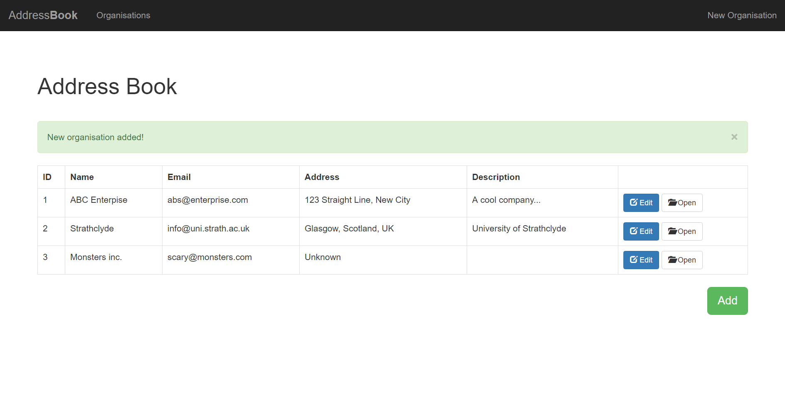
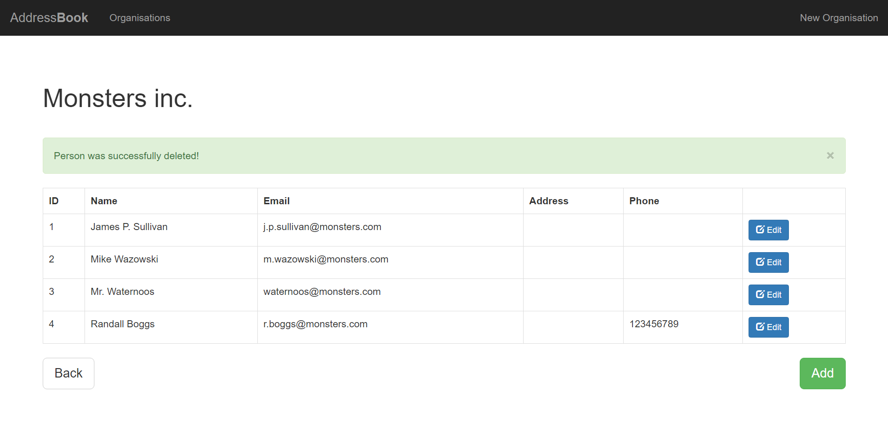
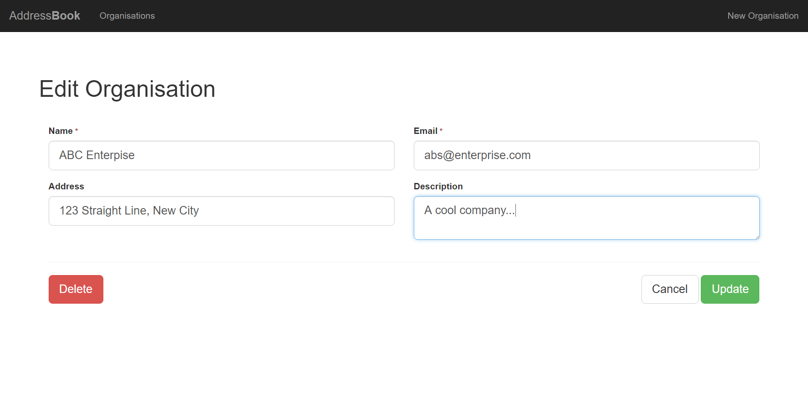
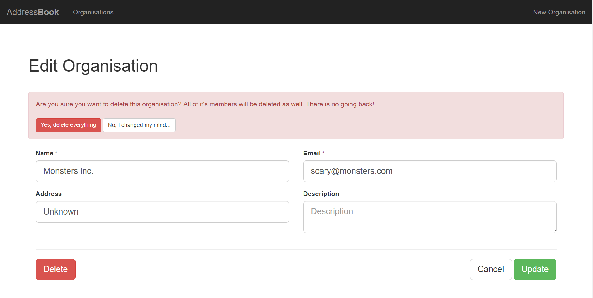
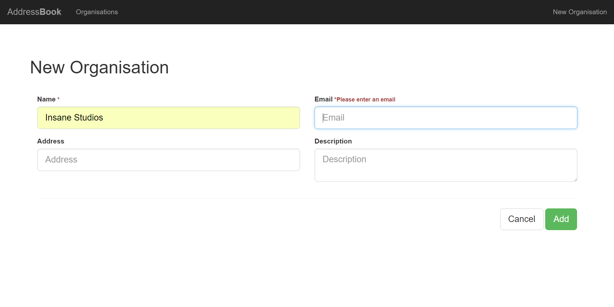

# AddressBook

A simple PHP/MySQL coding exercise. The aim was to build a server side persistent AddressBook web application with a simple, 
user-friendly interface. The address book lists organisations and people. It alows users to see the names and contact 
details of people in organisations, and to manage the people who are in an organisation. It stores a name and contact 
details for each organisation. The organisations and peole can be created, edited and deleted. There in no authentication 
or authorisation built-in.

## Some screens

